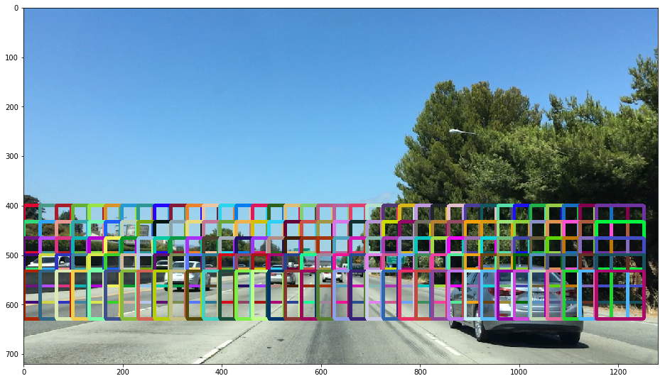
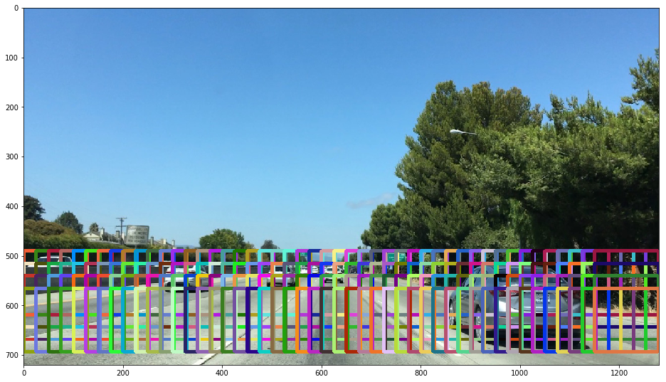
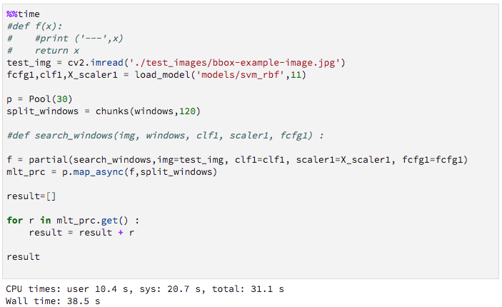

# **Vehicle Detection**

---

**Vehicle Detection Project**

The goals / steps of this project are the following:

* Perform a Histogram of Oriented Gradients (HOG) feature extraction on a labeled training set of images and train a classifier Linear SVM classifier
* Optionally, you can also apply a color transform and append binned color features, as well as histograms of color, to your HOG feature vector.
* Note: for those first two steps don't forget to normalize your features and randomize a selection for training and testing.
* Implement a sliding-window technique and use your trained classifier to search for vehicles in images.
* Run your pipeline on a video stream (start with the test_video.mp4 and later implement on full project_video.mp4) and create a heat map of recurring detections frame by frame to reject outliers and follow detected vehicles.
* Estimate a bounding box for vehicles detected.

---

### Histogram of Oriented Gradients (HOG)

The code for this step is contained in the IPython notebook `01_HoG_feature.ipynb`.

#### 1. Explain how (and identify where in your code) you extracted HOG features from the training images.

I started by reading in all the `vehicle` and `non-vehicle` images.  

```pytnon
cars = glob.glob('dataset/prj_ds/vehicles/*/*.png')
notcars = glob.glob('dataset/prj_ds/non-vehicles/*/*.png')
```

Here are 5% random sample images of each of the `vehicle` and `non-vehicle` classes.


I then explored different color spaces and different `skimage.hog()` parameters (`orientations`, `pixels_per_cell`, and `cells_per_block`).  I grabbed random images from each of the two classes and displayed them to get a feel for what the `skimage.hog()` output looks like.

Here is an example using the `gray` color space and HOG parameters of `orientations=8`, `pixels_per_cell=(8, 8)` and `cells_per_block=(2, 2)`:


#### 2. Explain how you settled on your final choice of HOG parameters.

I tried various combinations of parameters. Following is the parameter configuration map.

```python
feature_config = [
    {'clbl':0, 'cspc':'RGB', 'ori':9, 'ppc':8, 'cblk':2, 'ch':'ALL', 'etime':0 },
    {'clbl':1, 'cspc':'GRAY','ori':9, 'ppc':8, 'cblk':2, 'ch':0 ,    'etime':0 },

    {'clbl':2, 'cspc':'HLS', 'ori':9, 'ppc':8, 'cblk':2, 'ch':1 ,    'etime':0 },
    {'clbl':3, 'cspc':'HLS', 'ori':9, 'ppc':8, 'cblk':2, 'ch':2 ,    'etime':0 },
    {'clbl':4, 'cspc':'HLS', 'ori':9, 'ppc':8, 'cblk':2, 'ch':'ALL', 'etime':0 },

    {'clbl':5, 'cspc':'HSV', 'ori':9, 'ppc':8, 'cblk':2, 'ch':1    , 'etime':0 },
    {'clbl':6, 'cspc':'HSV', 'ori':9, 'ppc':8, 'cblk':2, 'ch':2    , 'etime':0 },
    {'clbl':7, 'cspc':'HSV', 'ori':9, 'ppc':8, 'cblk':2, 'ch':'ALL', 'etime':0 },

    {'clbl':8, 'cspc':'YUV', 'ori':9, 'ppc':8, 'cblk':2, 'ch':0    , 'etime':0 },
    {'clbl':9, 'cspc':'YUV', 'ori':9, 'ppc':8, 'cblk':2, 'ch':1    , 'etime':0 },
    {'clbl':10,'cspc':'YUV', 'ori':9, 'ppc':8, 'cblk':2, 'ch':2    , 'etime':0 },
    {'clbl':11,'cspc':'YUV', 'ori':9, 'ppc':8, 'cblk':2, 'ch':'ALL', 'etime':0 }
]
```


Given the setup, `etime` of the following table shows feature extraction time.


#### 3. Describe how (and identify where in your code) you trained a classifier using your selected HOG features (and color features if you used them).

The code for this step is contained in the IPython notebook `01_HoG_feature.ipynb`.

Given the features extracted from each of the parameter combinations, I trained two models one `Linear SVM` and `SVM with rbf kernel`.

Following shows the training accuracy and the training time.

##### Linear SVM


##### SVM with rbf (Radial-basis function kernel) kernel


While training SVM with rbf kernel took much longer than linear SVM, it showed better performance (in accuracy).

Therefore, for the next steps, I used `SVM with rbf kernel` trained with the HoG feature extracted using parameter of

```python
{'clbl':11,'cspc':'YUV', 'ori':9, 'ppc':8, 'cblk':2, 'ch':'ALL'}
```

##### classification examples


### Sliding Window Search

The code for this step is contained in the IPython notebook `02_SlidingWindow.ipynb`.

#### 1. Describe how (and identify where in your code) you implemented a sliding window search.  How did you decide what scales to search and how much to overlap windows?

Basically, I've rather applied exhaustive (expensive) search of the road area taking advantage of parallel processing.

I've tested various combinations of window scale, xy-overlaps, range to scan, etc.
Then I realized that it increases `false negative ratio` by increasing window steps. Considering nature of perspectives, I've appleid small size window more to far distance objects, etc. But made the steps very small.

```python
windows = slide_window(image, x_start_stop=[None, None], y_start_stop=[400, 630],
            xy_window=(64, 64), xy_overlap=(0.9,0.9))
```


```python
windows = slide_window(image, x_start_stop=[None, None], y_start_stop=[400, 650],
            xy_window=(96, 96), xy_overlap=(0.9, 0.9))
```



```python
windows = slide_window(image, x_start_stop=[None, None], y_start_stop=[450, 700],
            xy_window=(128, 128), xy_overlap=(0.9, 0.9))
```



This configuration introduced total `9127` windows to examine (to classify).
For this project, rather than trying to optimize the windowing approach, I've used parallel processing for classifying these windows.

```python
def detect_cars(frame, windows, clf1, X_scaler1, fcfg1, vis=False):

    p = Pool(30)
    split_windows = chunks(windows,30)

    f = partial(search_windows,img=frame, clf1=clf1, scaler1=X_scaler1, fcfg1=fcfg1)
    mlt_prc = p.map_async(f,split_windows)

    hot_windows=[]

    for r in mlt_prc.get() :
        hot_windows = hot_windows + r

    p.close(),p.join()

    window_img = draw_boxes(frame, hot_windows, color='random', thick=2)                

    if vis :
        fig = plt.figure(figsize=(16, 11))
        plt.imshow(cv2.cvtColor(window_img,cv2.COLOR_BGR2RGB))

    return hot_windows, window_img
```

In the above code, `windows` is the list of all the regions to examine generated by the sliding window. Then the search space (i.e., windows) were chunked into 30 pieces and fed to each async mapper of the classifiers.

Following is a simple benchmark result processing `13954` windows.


What took 5min with single process took just 38 seconds with 30 parallel processes.




#### 2. Show some examples of test images to demonstrate how your pipeline is working.  What did you do to optimize the performance of your classifier?

Ultimately I searched on three scales using YUV 3-channel HOG features. Applied classifier trained with rbf kernel, which provided a nice result.

Here are some example images:


---

### Video Implementation

#### 1. Provide a link to your final video output.  Your pipeline should perform reasonably well on the entire project video (somewhat wobbly or unstable bounding boxes are ok as long as you are identifying the vehicles most of the time with minimal false positives.)


- Vehicle detection of project video : Here's a [link to my project video result](./project_video_vehicle.mp4)

- Vehicle detection of test_video : Here's a [link to my test video result](./test_video_vehicle.mp4)


#### 2. Describe how (and identify where in your code) you implemented some kind of filter for false positives and some method for combining overlapping bounding boxes.

I've applied thresold based filtering given bounding boxes overlap of a region. Namely, from the positive detections I created a heatmap and then thresholded that map to identify vehicle positions.  I then used `scipy.ndimage.measurements.label()` to identify individual blobs in the heatmap.  I then assumed each blob corresponded to a vehicle.  I constructed bounding boxes to cover the area of each blob detected.  

#### 1. Here are six frames and their corresponding heatmaps:
#### 2. Here is the output of `scipy.ndimage.measurements.label()` on the integrated heatmap from all six frames:
#### 3. Here the resulting bounding boxes are drawn onto the last frame in the series:

Following shows the code cell for above mentioned 1. 2. 3. points

```python
heat = np.zeros_like(ti[:,:,0]).astype(np.float)
box_list, window_img = detect_cars(ti,search_space_window,clf1,X_scaler1,fcfg1)

heat = add_heat(heat,box_list)
# Apply threshold to help remove false positives
heat = apply_threshold(heat,1)

# Visualize the heatmap when displaying
heatmap = np.clip(heat, 0, 255)
labels = label(heatmap)
draw_img = draw_labeled_bboxes(np.copy(ti), labels)
```

When applied heatmap based labeling, final result look like following.


---

### Discussion

#### 1. Briefly discuss any problems / issues you faced in your implementation of this project.  Where will your pipeline likely fail?  What could you do to make it more robust?

In the end-to-end processing pipeline, the sliding window search part was the most expensive step. One could consider efficient use of geometric constraints for window region s. Another way to improve and relieve the burden of the sliding window step would be building a more robust car classifier. In this project, I haven't considered color histogram and its spatial distribution, but if trained with those features combined, the classifier could detect car regions even when greater step is used. One could also consider applying YOLO and SSD for this task.
 
